# somewm-milkii

Personal [somewm](https://github.com/trip-zip/somewm) (AwesomeWM fork) configuration, extracted from [dotfiles](https://github.com/mxmilkiib/dotfiles) as a git subtree.

The layout mirrors `$HOME` (`.config/somewm/...`) so the directory tree drops straight in. It happens to be a GNU Stow package in the parent repo, but nothing here needs Stow — see [Install](#install).

## Install

All the config needs is `.config/somewm/` ending up under `$HOME` — clone and symlink/copy it directly, or use whatever dotfiles manager suits. The author uses GNU Stow from the parent dotfiles repo (`stow somewm`, which symlinks the directory tree), but that's incidental — Stow, chezmoi, a bare `cp -r`, nothing specific is required.

Requires `somewm` itself (not vanilla AwesomeWM — several modules use somewm-only APIs: `idle::start`/`idle::stop`, `output` objects, `somewm-client` IPC, `somewm.layout_animation`). The theme is `milktheme/theme.lua`, loaded by `rc.lua`.

Everything Lua-side is vendored inside `.config/somewm/` — no submodule fetching or luarocks:

- widget/layout libraries: `lain`, `bling`, `treetile`, `vstack`, `thrizen`, `freedesktop`, `awesome-switcher`, `awesome-wm-widgets`, `battery-widget`, `media-player-widget`, `awesome-workspace-grid`
- window-management helpers: `collision`, `cyclefocus`, `revelation`, `tyrannical`
- `layouts/` — 13 custom tiling layouts: `bsp`, `expose`, `fibh`, `grid`, `msv`, `panes`, `quarter`, `scroller`, `slice`, `tabbed`, `tatami`, `threecol`, `widetile`

Compositor-shipped modules used but not vendored: `awful`, `gears`, `naughty`, `ruled`, `wibox`, `beautiful`, `menubar`, `lgi`.

External commands, all optional — a widget degrades to a `--` placeholder or empty list if its tool is missing:

| tool | used by |
|---|---|
| `wpctl` | volume popup / OSD |
| `playerctl` | media popup |
| `brightnessctl` | brightness popup, power dimming |
| `powerprofilesctl` | battery popup profile switcher, power |
| `upower`, `nmcli`, `bluetoothctl`, `cliphist`/`wl-paste`/`rofi`, `dbus-send` | sys_tray widgets |
| `socat` + `bin/wlr-brightnessd` | brightness popup gamma rows |
| `systemctl --user` | ai_popup service toggles, power suspend |

## Layout

```
.config/somewm/
├── rc.lua                 entry point: wibar, rules, signals, module wiring
├── error_guard.lua        guarded() pcall wrapper for all signal/timer callbacks
├── milktheme/theme.lua    beautiful theme: colours, fonts, wibar/popup metrics
├── floating_rules_data.lua  persisted per-class floating rules
├── keystats_db.lua        accumulated keybind usage stats
├── .ui_scale              persistent UI zoom factor (written by rc/ui_scale.lua)
├── bin/
│   ├── session-check      inspect/write the session state files
│   ├── notify-samples     fire a spread of notifications at the custom renderer
│   └── wlr-brightnessd    C daemon + Makefile: gamma-as-brightness over IPC socket
├── rc/                    config-side helpers
│   ├── font_utils.lua     FONT_* pango strings, ui_scale-aware
│   ├── ui_scale.lua       UI zoom factor
│   ├── keybindings.lua    all awful.key definitions (see Keybindings)
│   ├── tag_navigation.lua client-to-tag moves, occupied-tag cycling
│   ├── resize_no_warp.lua resize without pointer warp
│   └── startup_profiler.lua
├── plugins/               self-contained modules (see below)
├── layouts/               vendored tiling layouts (13, listed above)
└── <lib>/                 vendored awesome-ecosystem libraries
```

See also `CODEBASE_AUDIT.md` — a running audit of known issues and fixed findings.

## Screenshots

The bar: taglist, in-bar tag pager, system stats (net/cpu/gpu/ram/temp), battery/brightness/volume icons, systray, clock.

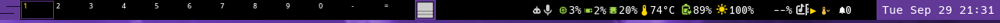

The layoutbox widget shows the current layout's glyph. Hovering opens a compact strip of layout icons; middle-click opens the full named grid. Left/right-click and the wheel cycle layouts directly.

| | | |
|---|---|---|
| 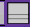 | 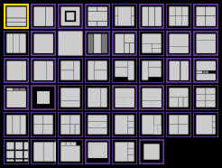 | 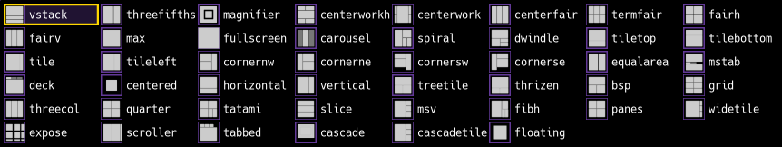 |
| layoutbox widget | hover strip | middle-click grid |

Clicking a bar widget opens its popup; all share the same purple-header style, pin button, drag-by-header and outside-click dismissal.

| | |
|---|---|
| 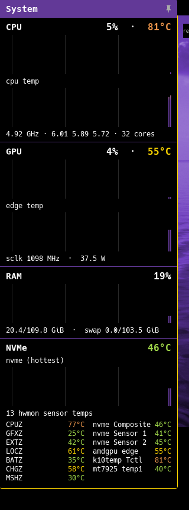 | 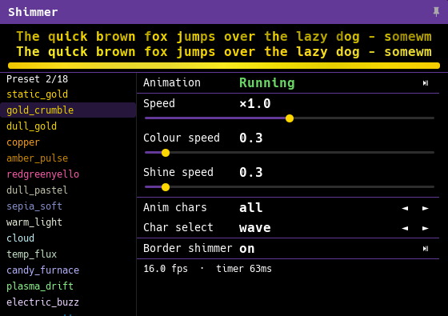 |
| resource monitor | shimmer animation config |
| 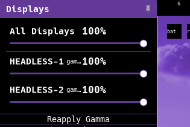 | 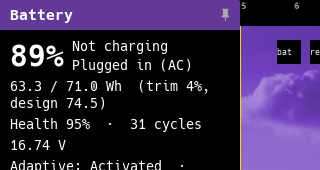 |
| per-output brightness/gamma | battery + power profiles |
| 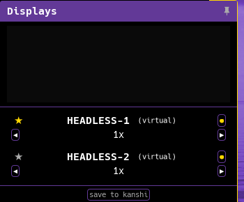 | 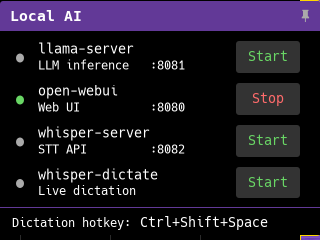 |
| output/mode/scale manager | local AI service toggles |
| 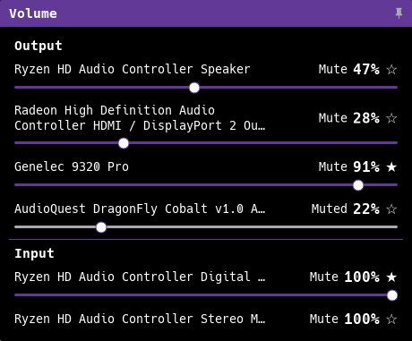 |  |
| per-sink/source volume | in-bar tag pager cells |

Notifications render as an in-bar banner anchored at the systray edge, with a braille-cell countdown; expired ones land in the notification centre:

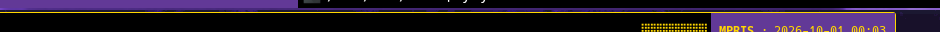
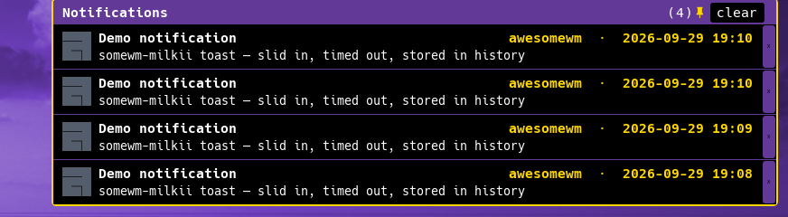

## Keybindings

All bindings live in `rc/keybindings.lua`: a single `build()` returning `globalkeys` and `clientkeys` tables built from rows of `{modifiers, key, action, description, class, group}`. `modkey` is `Mod4` (Super); `shiftkey`/`ctrlkey`/`altkey` are the usual aliases.

`Mod4+s` opens the hotkey help popup, patched for type-to-filter — start typing to narrow by key, modifier, description or group; PgUp/PgDn page, Esc/Enter dismiss. That popup is the authoritative, always-current reference; the shape of the map:

- **tags**: `Mod4+←/→` view prev/next tag, `Mod4+Alt+←/→` cycle tags carrying the client, `Mod4+1..0` jump
- **focus/swap**: `Mod4+j/k` focus, `Mod4+Shift+j/k` swap, `Mod4+Ctrl+j/k` focus screen, `Mod4+u` jump to urgent
- **layout**: `Mod4+h/l` master width, `Mod4+r`/`Mod4+Shift+r` cycle layout
- **launchers**: `Mod4+Return` terminal, `Mod4+d` rofi, `Mod4+grave` quake dropdown, `Mod4+Shift+F-keys` app toggles (firefox, keepassxc, quassel, ...)
- **wm**: `Mod4+Ctrl+r` reload, `Mod4+Shift+q` quit, `Mod4+Shift+Escape` power menu
- **shimmer**: `Mod4+Shift+Alt+c` cycle presets, `[`/`]`/`{`/`}` progression modes, `F1`–`F4` speeds (see `plugins/shimmer`)

## Shared conventions

### plugins/style.lua

Single source for visual constants. Everything resolves theme (`beautiful`) keys first — standard upstream names before this config's custom `main_gold`/`main_purple` tables — with a literal fallback last, so a module depending only on `plugins.style` still renders sanely under an arbitrary theme.

```lua
local style = require("plugins.style")
style.dpi(v)              -- dpi-scale a value
style.spacing.xxs .. .huge  -- 2 3 4 6 8 10 12 20 px scale, dpi-scaled
style.color.accent/.accent2/.fg/.fg_dim/.bg/.ok/.err/.hover
style.font.normal/.bold/.head/.mono/.small/.info/.value/.huge/...
style.font_size(n)        -- "<mono family> n" for call-site glyph sizing
style.popup.border_width/.radius/.margin_x/.margin_y/.spacing/.header_bg
style.size.icon           -- theme.icon_size or dpi(16)
style.merge(dst, opts)    -- shallow merge used by every M.configure
style.configure{...}      -- central overrides merged into the tables above
```

### CFG + configure()

Modules that have tunables expose one `CFG` table and one `configure`:

```lua
local resource_popup = require("plugins.resource_popup")
resource_popup.configure{ content_w = dpi(340), graph_cap = 240 }
```

Call `configure` before the widget is built (from `rc.lua`, before `attach`/`init`).

### plugins/popup_common.lua

Shared popup behaviour: theme/font surface (`popup_common.theme`, `popup_common.fonts`, backed by `style`), pin/stay-open state (`pin`, `load_stay_open`), outside-click teardown, header drag (`draggable_header`), anchor placement (`abs_anchor_rect`, `place_next_to`, `show_placement`), hover-highlight pinning (`sticky_border`), and the click-ordering flags that keep one press from both closing and reopening a popup. Modules register `popup_common.register_closer(hide)` so only one popup is open at a time; `attach` wires the standard left-toggle/right-hide buttons.

## Modules

### Popup widgets (wibar-anchored)

All attach with `M.attach(widget)`; left-click toggles unless noted. Right-click hides.

| module | trigger widget | contents |
|---|---|---|
| `plugins/resource_popup` | cpu/ram stat | CPU/GPU/RAM/NVMe graphs + sensor temps, fan summary |
| `plugins/battery_popup` | battery icon | charge state, capacity/health/cycles, power-profile switcher |
| `plugins/brightness_popup` | brightness icon | per-output brightness + gamma, `wlr-brightnessd` reapply |
| `plugins/volume_popup` | volume icon | per-sink/source `wpctl` sliders + mute; scroll adjusts default |
| `plugins/displays_popup` | brightness icon, **middle-click** | per-output enable/primary/scale/transform/mode chips, layout map, kanshi export |
| `plugins/ai_popup` | AI status glyph | local AI service status + start/stop (llama-server, whisper-server, open-webui, whisper-dictate) |
| `plugins/media_popup` | media icon | per-player MPRIS rows incl. KDE Connect |
| `plugins/shimmer_popup` | shimmer widget | shimmer animation controls: presets, sliders, char selection |
| `plugins/notification_center` | keybind / toggle widget | notification history; `notification_center_width`/`_margins`/`_shape`/`_header_bg` theme keys |

### OSD / display

- `plugins/notifications` — custom notification renderer: slide-in animation, manual stacking anchored at the systray edge, braille countdown glyph, min-width floor. `CFG`: `slide_duration`, `gap`, `top_margin`, `right_gap`, `max_width`, `min_width_frac`, `timeout`.
- `plugins/volume_osd` — volume-change toast; pairs with `plugins/volume_popup`.
- `plugins/brightness` — brightness hotkey handler + OSD (hardware `brightnessctl`, else `wlr-brightnessd` gamma).

### Bar widgets

- `plugins/system_widgets` — compact stat widgets (net/cpu/gpu/ram/temp glyphs), volume, keyboard layout, show-desktop toggle. Shared polling loop; `style.font_size(n)` for glyph sizing.
- `plugins/sys_tray` — SVG-icon tray widgets: bluetooth, clipboard (cliphist/rofi), MPRIS play/pause, battery (upower), wifi (nmcli). `CFG.icon_size`.
- `plugins/tag_pager` — KDE-pager-style tag cells in the bar + `show`/`hide`/`toggle` overlay; drag clients between cells (moves live on hover, dwell to view the target tag). `CFG`: `drag_threshold`, `refresh_delay`.
- `plugins/tag_indicators` — tag occupancy squares under taglist.
- `plugins/mode_glyphs` — stable per-mode glyphs for tasklist items.

### Behaviour / plumbing

- `plugins/shimmer` — unified animation engine (facade over `shimmer/animation`, `shimmer/border`, `shimmer/integrations`): per-character text shimmer, window-border shimmer, widget integration, preset management. Controls live in `shimmer_popup` and the `Mod4+Shift+Alt` hotkeys.
- `plugins/session` — saves/restores window state across reload: selected tag per screen, per-tag layout + `master_width_factor`/counts/gap, per-client tags/flags/floating geometry, and tiling order. State lives in `~/.local/state/somewm/` (`selected-tags`, `client-placements`, `tag-layouts`); inspect with `bin/session-check`.
- `plugins/dnd_to_tag` (`plugins/awesome_dnd` shim) — drag a client onto a taglist cell to move it; `M.config` colours come from `border_urgent`/`bg_focus`/`fg_focus`.
- `plugins/screensaver` — warp starfield + wandering clock on `idle::start`, DPMS off at `dpms_timeout`; `awesome.idle_inhibit` suppresses everything.
- `plugins/power` — lid/suspend handling, battery-driven dimming.
- `plugins/smart_borders` — borders only when >1 tiled client shares a tag.
- `plugins/solo_super` — tap-Super launcher toggle without a keygrabber.
- `plugins/shake_cursor` — shake-to-enlarge pointer (KWin port).
- `plugins/window_fx` — open/close fades, dim-out, shadows on the somewm animation clock.
- `plugins/floating_rules` — persistent per-class floating rules (replaces `rc/add-floating-rule.sh`).
- `plugins/hotkey_dupe_detector` — startup audit for duplicate keybindings.
- `plugins/keystats` + `plugins/keystats_cli` — keybind usage stats to `~/.config/somewm/keystats_db.lua` + CLI viewer.
- `plugins/ipc_rescue` — Lua-side IPC listener rebuild if the compositor socket is stolen/unlinked.
- `plugins/systray_dedup` — drops SNI icons orphaned by hot-reload.
- `plugins/systray_icon_cache` — caches systray icon surfaces/theme-path lookups.
- `plugins/screen_rotation` — multi-display rotation helper.
- `plugins/grab_debug` — **temporary diagnostic**: logs every mousegrabber transition with an attribution tag to `~/.local/state/somewm/grab-debug.log`, for hunting stuck pointer grabs. Remove once the mystery is solved.

## Runtime state

- `~/.local/state/somewm/` — session files (`selected-tags`, `client-placements`, `tag-layouts`), `grab-debug.log`
- `.config/somewm/.ui_scale` — persisted UI zoom factor
- `.config/somewm/keystats_db.lua`, `.config/somewm/floating_rules_data.lua` — accumulated data committed alongside the config
- `bin/wlr-brightnessd` socket — queried over unix socket by `brightness_popup`/`brightness`

## Headless testing

`somewm-client` can run a nested headless instance without touching the live compositor:

```sh
somewm-client test start --name cfg --host headless
somewm-client test eval  --name cfg 'awesome._test_add_output(1920, 1080)'
somewm-client test eval  --name cfg 'return require("plugins.volume_popup").is_visible()'
somewm-client test logs  --name cfg
somewm-client test stop  --name cfg
```

Screenshots of headless screens work via `awful.screenshot{screen=..., file_path=...}` or `geometry={x,y,width,height}` for a region crop. Set `require("plugins.screensaver").set_inhibit(true)` first or the idle saver dims the frame after a few minutes.

## Notes / limitations

- Hard-coded to this machine in places: `wlr-brightnessd` socket path, AI service unit names, `/sys/class/power_supply` paths, Adwaita icon dir. All degrade gracefully but aren't portable config yet.
- `plugins/notifications` replaces naughty's popup path; vanilla AwesomeWM lacks some APIs it relies on.
- Plugin `dpi()` is `beautiful.xresources.apply_dpi` — it does *not* include the `ui_scale` factor (that would double-apply since theme fonts already scale).
